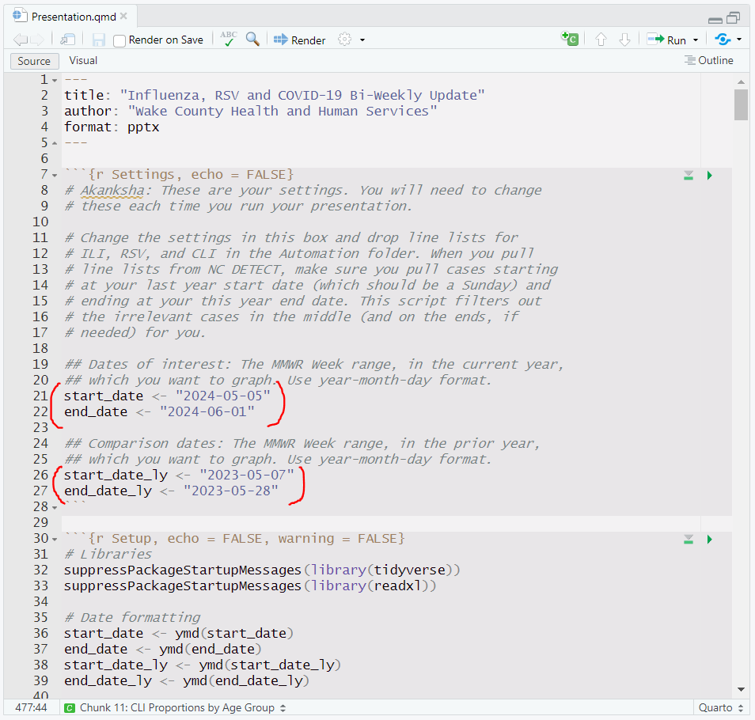

# Respiratory Viruses

The Epidemiology Program at WCHHS, during flu season, publishes a bi-weekly update on respiratory viruses using data from the North Carolina Disease Event Tracking and Epidemiologic Collection Tool (NC DETECT), which collects emergency department case data and classifies reported syndromes. Three conditions are pulled from NC DETECT: influenza-like illness (ILI), COVID-like illness (CLI), and respiratory syncytial virus (RSV). Emergency department data can provide insight into community levels of disease, and it is particularly useful when other means of reporting are unavailable or inconsistent.

This section walks through the process of automating the production of these bi-weekly reports in R. This process uses Quarto, which is an advanced implementation of RMarkdown, to generate a PowerPoint presentation. From within RStudio, R code can be executed, graphics can be rendered, and text can be written. Once Quarto (in RStudio) renders the presentation, the .pptx file can be manually edited, and a standard theme (such as Wake County's preferred slide theme) can be applied in PowerPoint.

If you are only looking for instructions on how to automatically generate the presentation, skip to [rendering and formatting](#rendering-and-formatting).

## Header content

Unlike previous projects in this presentation, where the format was essentially just a vehicle for delivery, the presentation format is essential to the project. Instead of libraries, then, we will start at the top: the RMarkdown header.

```         
---
title: "Influenza, RSV and COVID-19 Bi-Weekly Update"
author: "Wake County Health and Human Services"
format: pptx
---
```

The header includes three elements:

1.  The title of the presentation, which will go on the title slide.
2.  The author of the presentation, which will go beneath the title.
3.  The presentation format, which should be pptx unless you are familiar with another supported format.

We do not need to create a separate title slide below the header because the header will be used to generate the title slide.

## Settings and setup

Because this presentation's code is intended to be infinitely reusable, a settings chunk is included at the top, where instructions are included for setting the dates of interest.

```{r Settings}
## Dates of interest: The MMWR Week range, in the current year,
## which you want to graph. Use year-month-day format.
start_date <- "2024-05-05"
end_date <- "2024-06-01"

## Comparison dates: The MMWR Week range, in the prior year,
## which you want to graph. Use year-month-day format.
start_date_ly <- "2023-05-07"
end_date_ly <- "2023-05-28"
```

In this section, we set (in year-month-day format) the start and end dates for analysis. Dates for both the current year and the prior (comparison) year must be included, since weeks do not start on the same date. When all of these dates are Sundays, the code treats `start_date` and `start_date_ly` as the first dates for analysis, and it treats `end_date` and `end_date_ly` as the *first day of the last week* to be included in the analysis. Choosing any day except Sunday for the end dates will select the week they are in, so choosing Saturday as your end date will work as expected.

Before running the presentation, files also need to be dropped into the folder. NC DETECT allows for line list exports, and these line lists are used for the presentation. Three files, named CLI.xlsx, ILI.xlsx, and RSV.xlsx, need to be added to the Automation folder, and they should include all cases between your chosen `start_date_ly` and your `end_date`. We'll see later how the code filters out the cases between `end_date_ly` and `start_date` so they don't interfere with the graphs.

Once we've set the dates and are ready to continue running the presentation, the code will format the dates. We will also need to load the libraries.

```{r Setup p1}
# Libraries
suppressPackageStartupMessages(library(tidyverse))
suppressPackageStartupMessages(library(readxl))

# Date formatting
start_date <- ymd(start_date)
end_date <- ymd(end_date)
start_date_ly <- ymd(start_date_ly)
end_date_ly <- ymd(end_date_ly)
```

As we have previously, we use `tidyverse` and `readxl`. One `tidyverse` package, called `lubridate`, will be helpful here as we format dates: the `ymd()` function informs R that the dates we chose before are dates in year-month-day format.

## Importing data

Next, we write a function to read and modify the NC DETECT data. This is a long one, and several `mutate` steps are used here to make sure the variables are modified and read in a useful order. Also note the use of `%>%` (pipe) characters to order this function. Without piping, the functions would have to be nested with the last function on the outside, which would make this code practically unreadable.

```{r Setup p2}
# Assign to `sesh_import` a function with one argument (x) and the following code
sesh_import <- function(x){
  
  # Begin with the data, given to the function as an argument
  x %>% 
    
    # Mutate variables
    mutate(
      
      # Modify three variables from character type to date-time (year-month-day, hour-minute-second) type
      "Arrival Date Time" = ymd_hms(`Arrival Date Time`),
      "(beta) ED Discharge DT" = ymd_hms(`(beta) ED Discharge DT`),
      "(beta) Hospital Discharge DT" = ymd_hms(`(beta) Hospital Discharge DT`)
    ) %>% 
    
    # Mutate more variables
    mutate(
      
      # Create `Arrival`, which takes just the date information from `Arrival Date Time`
      "Arrival" = as_date(`Arrival Date Time`),
      
      # Calculate the epi week, starting on Sunday, when the case occurred
      "MMWR Week" = case_when(
        wday(Arrival) == 1 ~ Arrival, # If the arrival day was Sunday, use that day
        wday(Arrival) > 1 ~                  # If the arrival day was not Sunday...
          Arrival - days(wday(Arrival)) + 1, # ...determine the most recent Sunday
        .default = NA # If there is no arrival date, return NA
      ),
      
      # Calculate the epi year
      "MMWR Year" = year(`MMWR Week`),
      
      # Delete the arrival date time variable (it's not very useful)
      "Arrival Date Time" = NULL,
      
      # Put these variables at the beginning (before column 1)
      .before = 1
    ) %>% 
    
    # Mutate more variables
    mutate(
      
      # Make `Patient Age` a numeric (not character) variable
      `Patient Age` = as.numeric(`Patient Age`),
      
      # Make `Patient Age Group` an ordered variable (factor)
      `Patient Age Group` = factor(
        # Keep the same values as the original dataset's (.) variable ($`Patient Age Group`)
        x = .$`Patient Age Group`,
        # Make the variable ordinal, and order its values this way
        levels = c("Infant (0 - 1)", "PreSchool (2 - 4)",
                   "Elem. School (5 - 9)", "Middle School (10 - 14)",
                   "High School (15 - 18)", "College (19 - 24)",
                   "Young Adult (25 - 44)", "Middle Aged (45 - 64)",
                   "Senior (65+)")
      ),
      
      # Make two more variables numeric - this will throw an error if data is unclean
      `Patient ZIP` = as.numeric(`Patient ZIP`),
      `Init Temp` = as.numeric(`Init Temp`),
      
      # Make Race and Ethnicity factors as well
      Race = factor(
        x = .$Race,
        levels = c("Asian", "Black", "White", "Other")
      ),
      Ethnicity = factor(
        x = .$Ethnicity,
        levels = c("Hispanic", "Not of Hispanic Origin", "Unknown")
      )
    ) %>% 
    
    # Create an age group variable using `Patient Age` and order it
    mutate(`Age Group` = factor(
      x = case_when(
        `Patient Age` <= 4 ~ "(00 - 04) Infant/Toddler",
        `Patient Age` >= 5 & `Patient Age` <= 17 ~ "(05 - 17) School-Age",
        `Patient Age` >= 18 & `Patient Age` <= 24 ~ "(18 - 24) College",
        `Patient Age` >= 25 & `Patient Age` <= 49 ~ "(25 - 49) Young Adult",
        `Patient Age` >= 50 & `Patient Age` <= 64 ~ "(50 - 64) Middle Aged",
        `Patient Age` >= 65 ~ "(65+) Senior",
        .default = "Unknown/Missing"
      ),
      levels = c("(00 - 04) Infant/Toddler", "(05 - 17) School-Age", "(18 - 24) College",
                 "(25 - 49) Young Adult", "(50 - 64) Middle Aged", "(65+) Senior",
                 "Unknown/Missing")
    )) %>% 
    
    # Filter out data that isn't in the specified epi week range
    filter((`MMWR Week` >= start_date & `MMWR Week` <= end_date) |
             (`MMWR Week` >= start_date_ly & `MMWR Week` <= end_date_ly)) %>% 
    
    # Modify epi year values to keep seasons together (see note)
    mutate(
      "modified" = case_when(
        year(end_date) - year(start_date) == 1 &
          str_detect(`MMWR Week`, "-08-|-09-|-10-|-11-|-12-") ~ TRUE,
        .default = FALSE
      ),
      "MMWR Year" = case_when(
        year(end_date) - year(start_date) == 1 &
          str_detect(`MMWR Week`, "-08-|-09-|-10-|-11-|-12-") ~ `MMWR Year` + 1,
        .default = `MMWR Year`
      )
    )
}
```

There is a lot here! There are two main things that need more explanation than the code comments: factors and modifying epi year values.

### Factors

*Factors* are ordered categorical variables. We use them when we have a variable with text values that have an inherent (non-alphabetical) order. A good example is `Patient Age Group`: if we left it as a regular character variable, it would be ordered like this:

```{r Setup p2demo, echo = FALSE}
c("Infant (0 - 1)", "PreSchool (2 - 4)", "Elem. School (5 - 9)", "Middle School (10 - 14)", "High School (15 - 18)", "College (19 - 24)", "Young Adult (25 - 44)", "Middle Aged (45 - 64)", "Senior (65+)") %>% sort()
```

But we don't want them to be alphabetical, because that doesn't make sense for the data. A factor allows us to take data (given in the `x` argument) and order it according to a list or vector we create (given in the `levels` argument). If you are familiar with SAS, this is very similar to coding variables as numeric and using `PROC FORMAT` to cover the underlying number, except that R never requires you to remember or use the number directly.

### Modifying the epi year

Because flu season runs from fall to spring, our line graphs need to span the gap between December and January. The best way to do this is to tweak the epi year, so that (as an example) the 2023-2024 season will appear on the graph as a continuous line for 2024. We only need this feature to activate when the following conditions are met:

1.  `start_date` and `end_date` are in different years.
2.  The case occurred in or after August, which will always catch the beginning of fall.

We can evaluate the first condition by just subtracting the years. For the second condition, we use `str_detect` to check the month, which will always be between the two dashes in year-month-day format. If these conditions are met, we adjust the year up by one to keep the lines continuous, and we also set a new `modified` variable to `TRUE` so we know this case was affected.

More work is needed to solve this problem, which we'll see in the graphing code later.

### Reading the files

Finally, we actually read the files using the function we created above.

```{r Setup p3, eval = FALSE}
# Read files
ILI <- read_xlsx("ILI.xlsx") %>% 
  sesh_import()
RSV <- read_xlsx("RSV.xlsx") %>% 
  sesh_import()
CLI <- read_xlsx("CLI.xlsx") %>% 
  sesh_import()
```

```{r Setup p3act, echo = FALSE, warning = FALSE}
ILI <- read_xlsx("../Data/ILI.xlsx") %>% 
  sesh_import()
```

We use `read_xlsx` from the `readxl` package to read each file and pipe the data into `sesh_import` above. Now, our data is imported.

## Highlights slide

For the presentation, all code is invisible, because the R code chunks in our Quarto document include the option `echo = FALSE` (unlike *this* presentation, where we want to see the code). Because code is invisible, everything between the header and now is performed, but it isn't displayed on the slides. However, we do want to show some content.

We want to create a Highlights slide, where an epidemiologist can include main takeaways from the data collected for the presentation. We want space for content to be added to the PowerPoint after it's generated, but nothing here needs to be run in R, so we can just use plain text in Markdown syntax.

```         
# Highlights

-   Influenza Like Illness (ILI)
    -   Content here
-   Respiratory Syncytial Virus (RSV)
    -   Content here
-   COVID-19
    -   Content here
```

The `#` creates a first-level heading, which in the context of a presentation becomes the title of a new slide. If we wanted subheadings, we could use `##`. Then, we use `-` and indentations to create unordered bullets and sub-bullets. Content can be edited on the .qmd document, but it is probably more useful and efficient in this case to do it directly on the PowerPoint after rendering.

[RMarkdown syntax](https://rstudio.github.io/cheatsheets/html/rmarkdown.html) is very powerful, and very little of it is used for this specific presentation, so see the website for details. You can also see the Resources and Preventive Measures sections of the Quarto presentation document for more examples.

## Graphing

Now, we can start to graph the data we've pulled. I'll include only the code and graphs for influenza-like illness here, because each disease's graphs work the same way, but the .qmd file on the SharePoint generates graphs for ILI, RSV, and CLI.

For graphing, as elsewhere in this presentation, we use `ggplot2` from the tidyverse.

### ILI counts by week

To create this graph, we need to do a few things:

1.  Select the `ILI` data.
2.  Extract just the month and day from the epi week fields to save space. Additionally, when the graph would straddle January 1 of any year, modify dates before January 1 so they appear to the left of dates after January 1.
3.  Group cases by epi week and year, then count cases in each group.
4.  Plot a line graph with two lines, one for each year, showing the counts.

We complete those steps with this code:

```{r ILI Counts by Week, eval = FALSE}
# 1. Select the `ILI` data
ILI %>% 
  
  # 2. Extract just the month and day from `MMWR Week`
  mutate(
    `MMWR Week` = case_when(
      modified == FALSE ~ paste(
        sprintf("%02d", month(`MMWR Week`)),
        sprintf("%02d", day(`MMWR Week`)), sep="-"
        ),
      # 2a. Modify dates before 1/1 to appear to the left
      modified == TRUE ~ paste(
        "",
        sprintf("%02d", month(`MMWR Week`)),
        sprintf("%02d", day(`MMWR Week`)), sep="-"
        )
      ),
    ## Modify the year to be discrete rather than continuous (for display purposes)
    `MMWR Year` = as.character(`MMWR Year`)
  ) %>% 
  
  # 3. Group cases by epi week and year, then tally cases
  group_by(`MMWR Year`, `MMWR Week`) %>% 
  tally(name = "Count") %>%
  
  # 4. Plot a line graph
  ggplot(aes(x = `MMWR Week`, y = Count, color = `MMWR Year`,
             group = `MMWR Year`)) +
  geom_line(linewidth = 2) +
  ylim(0, NA) +
  labs(
    x = "Week",
    color = "Year"
  ) +
  scale_color_brewer(palette = "Set2") +
  theme_minimal() +
  ggtitle("ILI Counts by Week") +
  theme(
    legend.position = "bottom",
    plot.title = element_text(hjust = 0.5)
  )
```

We start by piping `ILI` forward to the next function. Then, there are two scenarios:

1.  For cases where `MMWR Year` was not modified, we extract the month and day (using `sprintf()`, which gets and reformats variable values) from `MMWR Week`, then `paste()` them together with a dash in between.
2.  For cases where `MMWR Year` *was* modified, we do the same thing, except we also add a dash in front of the month by including `""` (which is a blank string) in our `paste()` before the month. R will alphabetize the dash before numbers, so December will appear before January.

In our `mutate()`, we also modify the epi year to be a character variable, which lets us deal with it as a discrete variable instead of a continuous one.

Next, as we've done for previous graphs, we group cases by their epi week and year and tally the groups, leaving us with graphable data. Finally, we plot:

1.  We use `aes()` to define the variables for our x-axis, y-axis, and line coloring.
2.  We choose a line graph with `geom_line()` and set its thickness (2).
3.  We set the y-axis limits with `ylim()`, where we want the graph to go from 0 to ggplot's chosen maximum, which we request with `NA`.
4.  We change the x-axis and legend titles.
5.  We choose our coloring scheme, in this case from RColorBrewer's palettes.
6.  We set our ggplot theme.
7.  We set a plot title with `ggtitle()`.
8.  We modify the legend position and the plot title alignment by changing specific `theme` elements.

While the order of some of these elements is flexible, some are not. For instance, if `theme()` came before `theme_minimal()`, any settings we specified in `theme()` would be reset. When writing your own graph code, you will need to use trial and error to determine the best order for your use case.

That leaves us with a line graph of the counts, compared between years. Below is a sample generated for the last report of the 2023-2024 flu season.

```{r ILI Counts by Week act, echo = FALSE}
ILI %>% 
  mutate(
    `MMWR Week` = case_when(
      modified == FALSE ~ paste(
        sprintf("%02d", month(`MMWR Week`)),
        sprintf("%02d", day(`MMWR Week`)), sep="-"
        ),
      modified == TRUE ~ paste(
        "",
        sprintf("%02d", month(`MMWR Week`)),
        sprintf("%02d", day(`MMWR Week`)), sep="-"
        )
      ),
    `MMWR Year` = as.character(`MMWR Year`)
  ) %>% 
  group_by(`MMWR Year`, `MMWR Week`) %>% 
  tally(name = "Count") %>%
  ggplot(aes(x = `MMWR Week`, y = Count, color = `MMWR Year`,
             group = `MMWR Year`)) +
  geom_line(linewidth = 2) +
  ylim(0, NA) +
  labs(
    x = "Week",
    color = "Year"
  ) +
  scale_color_brewer(palette = "Set2") +
  theme_minimal() +
  ggtitle("ILI Counts by Week") +
  theme(
    legend.position = "bottom",
    plot.title = element_text(hjust = 0.5)
  )
```

### ILI counts by age group

To graph counts by age group, we need to do a few things differently.

1.  We no longer need a comparison year, so we will filter and keep only data for only the current season.
2.  For grouping, we'll substitute age group in for epi year, since we are not comparing years.
3.  Because cases do not always span all demographics, we need to fill in zeroes for weeks when an age group does not have any cases.
4.  When plotting, our lines will be colored according to age group rather than year.

This code generates the necessary graph. Code is spaced for easier viewing, and comments are included where there are differences from the counts by year graph.

```{r ILI Counts by Age Group}
ILI %>% 
  
  # 1. Filter and keep only current season data
  filter(year(`MMWR Week`) == year(start_date) |
           year(`MMWR Week`) == year(end_date)) %>% 
  
  mutate(
    `MMWR Week` = case_when(
      modified == FALSE ~ paste(
        sprintf("%02d", month(`MMWR Week`)),
        sprintf("%02d", day(`MMWR Week`)), sep="-"
        ),
      modified == TRUE ~ paste(
        "",
        sprintf("%02d", month(`MMWR Week`)),
        sprintf("%02d", day(`MMWR Week`)), sep="-"
        )
      ),
    `MMWR Year` = as.character(`MMWR Year`)
  ) %>% 
  
  # 2. Group by age and epi week
  group_by(`Age Group`, `MMWR Week`) %>% 
  
  tally(name = "Count") %>% 
  
  # 3. Fill in zero when there are no cases in an age group for a week
  ungroup() %>% 
  complete(`MMWR Week`, `Age Group`, fill = list(Count = 0)) %>% 
  
  # 4. Use age group to color lines
  ggplot(aes(x = `MMWR Week`, y = `Count`,
             color = `Age Group`,
             group = `Age Group`)) +
  geom_line(linewidth = 2) +
  ylim(0, NA) +
  labs(x = "Week", color = NULL) +
  scale_color_brewer(palette = "Set3") +
  ggtitle("ILI Counts of ED Visits by Age Group") + # The title is changed here
  theme_minimal() +
  theme(
    plot.title = element_text(hjust = 0.5),
    legend.position = "bottom",
    legend.text = element_text(size = 7), # Because there are so many legend items, the size
    legend.title = element_text(size = 9) # of legend text is changed to fit on the graph.
  )
```

When creating multiple graphs with the same data, it is often easier to code the first graph and make modifications rather than coding each graph from scratch. Re-using code is efficient and consistent!

### ILI proportions by age group

For the bi-weekly presentation, we also want to calculate the proportion of cases in each age group rather than just the counts. For this, we mostly recycle the counts graph code, but with a few modifications:

1.  We calculate the total number of cases each week by grouping the tallies and creating a Total variable.
2.  We calculate the proportion of weekly cases made up by each age group by dividing the Counts column by our new Total column.
3.  When graphing, we change the y-axis from counts to proportions.

This code generates the proportions graph. Again, see code comments to find where these modifications were made.

```{r ILI Proportions by Age Group}
ILI %>% 
  
  filter(year(`MMWR Week`) == year(start_date) |
           year(`MMWR Week`) == year(end_date)) %>% 
  
  mutate(
    `MMWR Week` = case_when(
      modified == FALSE ~ paste(
        sprintf("%02d", month(`MMWR Week`)),
        sprintf("%02d", day(`MMWR Week`)), sep="-"
        ),
      modified == TRUE ~ paste(
        "",
        sprintf("%02d", month(`MMWR Week`)),
        sprintf("%02d", day(`MMWR Week`)), sep="-"
        )
      ),
    `MMWR Year` = as.character(`MMWR Year`)
  ) %>% 
  
  group_by(`Age Group`, `MMWR Week`) %>% 
  tally(name = "Count") %>% 
  
  # 1. Group by epi week and total weekly cases
  group_by(`MMWR Week`) %>% 
  mutate("Total" = sum(Count)) %>% 
  
  # 2. Calculate proportions
  ungroup() %>% 
  mutate("Proportion" = Count / Total) %>% 
  
  complete(`MMWR Week`, `Age Group`, fill = list(Proportion = 0)) %>% 
  
  # 3. Graph proportions instead of counts
  ggplot(aes(x = `MMWR Week`, y = `Proportion`, # Change the y-axis values here
             color = `Age Group`,
             group = `Age Group`)) +
  geom_line(linewidth = 2) +
  ylim(0, NA) +
  labs(x = "Week", color = NULL) +
  scale_color_brewer(palette = "Set3") +
  ggtitle("ILI Proportions of ED Visits by Age Group") + # Change the plot title
  theme_minimal() +
  theme(
    plot.title = element_text(hjust = 0.5),
    legend.position = "bottom",
    legend.text = element_text(size = 7),
    legend.title = element_text(size = 9)
  )
```

Now we have a graph of proportions. Though the proportions and counts of ILI for these dates are very similar, that will not always be the case, so don't expect the counts and proportions graphs to be identical every time.

## Rendering and formatting

Now that the graphs are complete, we need to generate (render) and apply formatting to the presentation. **Before you start**, make sure you have replaced the line lists in the Automation folder. You will need to download three line lists: one for CLI (CLI_No_Flu), one for ILI (ILI), and one for RSV (RSV (ICD-9/10-CM or keyword)). When getting the line lists, the "date from" should be the first Sunday of the date range for the prior season, and the "date to" should be the last Saturday of the date range for the current season.

First, open the Automation R project in the Automation folder.


When RStudio opens, make sure `Presentation.qmd` is open. If it is not, you can select it in the bottom right part of the screen.

Then, edit your dates. `start_date` and `end_date` should be the date range (probably Sunday to Saturday) in which you would like to graph cases for the **current season**. `start_date_ly` and `end_date_ly` (`ly` stands for "last year") should be the date range that will be graphed from the **prior season** as a comparison. In general, `start_date_ly` should be a Sunday and `end_date_ly` should be a Saturday.



Next, click "Render" to generate the presentation. Any errors will appear in the console at the bottom-left.


A browser window may open, and the presentation may download. You can delete the file in your downloads and close the browser, because the presentation will appear in your Automation folder. Click `Presentation.pptx` at the bottom right of RStudio (or open it from the Automation folder in Windows Explorer).


You can now apply the official county theme to the presentation. Under the Design tab, click the dropdown option for themes, then click "Browse for Themes...".


The theme you need is already saved to the Automation folder. Navigate to the folder, then open `wake_theme.thmx`.


Now the theme is applied, and you can make any necessary changes to the text (such as the Highlights page).


## Final notes

Automating presentations in R can be very useful when similar reports need to be produced on a regular basis. Quarto makes this process simple, as you can generate an entire presentation from just one RMarkdown document, and R can be used to process and analyze your data the same way each time.

RStudio also includes the ability, at no cost, to make several other types of projects using the same syntax and environment. For example, this web presentation was generated with Bookdown, which we'll talk about briefly in the next section.